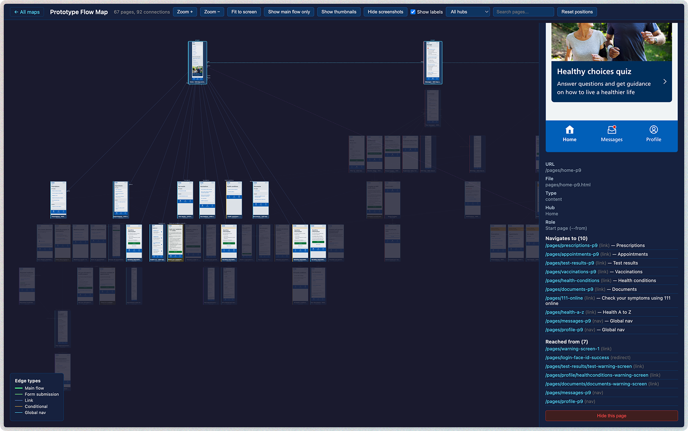

# Prototype Flow Map

Generate interactive flow maps from Express/Nunjucks prototype kit projects (NHS Prototype Kit, GOV.UK Prototype Kit, etc.).

Analyses your prototype's templates, routes, and conditional logic to produce a visual map of every screen and the connections between them — with screenshots.



## Features

- **Scenario-first mapping** — define realistic user journeys and map what users actually experience, not every possible route
- **Visit-driven mapping** — specify exact pages to visit, or let the crawler discover pages via BFS; supports interactive steps (`click`, `fill`, `check`, `select`) and `snapshot` for capturing session-dependent pages
- **Interactive workflow mapping** — walk through multi-step forms with checkboxes, radio buttons, text inputs, and expandable sections; sequential navigation edges are automatically created between click-navigated pages (even through redirects)
- **Combined scenario maps** — run multiple scenarios together and produce a merged side-by-side view with shared nodes (e.g. `/dashboard`)
- **Auto-discovers all pages** from Nunjucks templates (mirrors the prototype kit's auto-routing)
- **Extracts navigation** from `href` links, `<form action>` attributes, and JS redirects
- **Detects conditional branches** (`` blocks wrapping different links)
- **Parses Express route handlers** for explicit redirects and renders
- **Screenshots every page** using Playwright (headless Chromium), with dynamic height based on actual page content
- **Desktop mode** — capture screenshots at 1280x800 desktop viewport instead of mobile
- **Interactive web viewer** — pan, zoom, click nodes for detail, filter by provenance, toggle global nav, search
- **Layer-cake layout** — tab groups are arranged side-by-side at each level, with the flow progressing top to bottom following visit order
- **Shareable output** — a static HTML site you can open locally or deploy anywhere
- **PDF export** — optional `map.pdf`, with full-canvas layout as default

## Prerequisites

- Node.js 20+
- The prototype you want to map must be installable and runnable via `node app.js`

## Install

```bash
cd prototype-flow-map
npm install
npx playwright install chromium
```

## Mapping modes

The tool has three mapping modes:

| Mode | Purpose | Best for |
|---|---|---|
| `scenario` | Map realistic user journeys with setup steps and scoped crawling | Prototypes with seed data, stateful flows, or complex routing |
| `static` | Broad static analysis of all templates and routes | Simple prototypes without seed data |
| `audit` | Static analysis plus runtime crawl of every discoverable page | Debugging and coverage checks |

### Scenario mode (recommended for most prototypes)

Many prototypes use seed data — without the right user, site, or entity ID in the session, pages render as broken or empty screens. Scenario mode solves this by letting you define realistic user journeys with setup steps that establish the right state before crawling.

Instead of visiting every technically reachable URL, scenario mode:
1. Runs setup steps (login, select a user, navigate to a section)
2. Begins mapping from a meaningful start point
3. Either crawls via BFS within scope, or visits an explicit list of pages (visit-driven mode)
4. Supports interactive steps and snapshots for session-dependent pages
5. Captures screenshots of pages that are valid in context, with dynamic heights

The result is an experience map, not a route inventory.

#### Quick start with scenarios

```bash
# Run a single scenario
npx prototype-flow-map /path/to/prototype --scenario clinic-workflow

# Run a named set of scenarios
npx prototype-flow-map /path/to/prototype --scenario-set core-user-journeys

# List available scenarios
npx prototype-flow-map /path/to/prototype --list-scenarios
```

#### Writing scenarios

Scenarios can be defined in two formats: `.flow` files (recommended) or inline YAML in the config file.

##### `.flow` files (recommended)

Create a `scenarios/` directory in your prototype root. Each `.flow` file defines one scenario using a simple, readable format:

```
# Reception/clinic operational flow
# Appointments, events, check-in

Start /clinics
Scope /dashboard /clinics /events /reports
Exclude /prototype-admin /api /assets /settings /participants
Tags clinic appointment core
Limit pages 120
Limit depth 12

--- Setup ---

Use setup.clinician

--- Map ---

# Dashboard
Visit /dashboard

# Clinic tabs
Visit /clinics/today
Visit /clinics/upcoming
Visit /clinics/completed
Visit /clinics/all

# Navigate into an event dynamically
Goto /clinics/wtrl7jud/all
Click "a:has-text('View appointment')"
Snapshot

# Event detail tabs
Click "a[href*='/participant']"
Snapshot
Click "a[href*='/medical-information']"
Snapshot
```

The filename becomes the scenario name (e.g. `clinic-workflow.flow` → scenario `clinic-workflow`).

Here's a more complex example showing interactive form steps:

```
# Full check-in workflow
# Identity confirmation, medical history, imaging, completion

Start /clinics/wtrl7jud
Scope /clinics
Exclude /prototype-admin /api /assets
Tags clinic check-in workflow
Limit pages 30
Limit depth 15

--- Setup ---

Use setup.clinician

--- Map ---

Visit /clinics/wtrl7jud

# Navigate into event and start appointment
Goto /clinics/wtrl7jud
Click "a:has-text('View appointment')"
WaitForSelector "a:has-text('Start this appointment')"
Snapshot

Click "a:has-text('Start this appointment')"
Wait 1000
Snapshot

# Confirm identity
Click "button:has-text('Confirm identity')"
Wait 1000
Snapshot

# Fill breast cancer form
Check "#cancerLocationRightBreast"
Check "#proceduresRightBreast"
Fill "input[name='event[medicalHistoryTemp][locationNhsHospitalDetails]']" "Unknown"
Click "button[value='save']"
Wait 1000
Snapshot
```

##### `.flow` file format reference

**Header section** (before `--- Setup ---`):

| Directive | Example | Description |
|---|---|---|
| `Start` | `Start /clinics` | Start URL for the scenario |
| `Scope` | `Scope /dashboard /clinics` | Only follow links matching these path prefixes |
| `Exclude` | `Exclude /api /assets` | Never follow links matching these prefixes |
| `Tags` | `Tags clinic core` | Grouping labels |
| `Limit pages` | `Limit pages 120` | Maximum pages to visit |
| `Limit depth` | `Limit depth 12` | Maximum link depth |
| `Disabled` | `Disabled` | Skip this scenario when running all scenarios |

**Blocks:**

- `--- Setup ---` — steps that establish context (login, navigate to section). Not included in the map.
- `--- Map ---` — steps that contribute to the mapped journey. Everything after this marker appears in the output.

**Step types:**

| Step | Example | Description |
|---|---|---|
| `Goto` | `Goto /choose-user` | Navigate directly to a URL |
| `Click` | `Click "a:has-text('View')"` | Click an element by CSS selector |
| `Fill` | `Fill "#search" "HITCHIN"` | Fill an input field |
| `Select` | `Select "#dropdown" "Option"` | Choose a select option |
| `Check` | `Check "#myCheckbox"` | Check a checkbox or radio |
| `Submit` | `Submit form` | Submit a form by selector |
| `WaitForUrl` | `WaitForUrl /dashboard` | Wait for navigation to a URL |
| `WaitForSelector` | `WaitForSelector "text=Done"` | Wait until a selector appears |
| `Wait` | `Wait 1000` | Wait a number of milliseconds |
| `Visit` | `Visit /clinics/today` | Visit a page and add it to the map |
| `Snapshot` | `Snapshot` | Capture the current page as a map node |
| `Use` | `Use setup.clinician` | Include a reusable fragment |

Values containing spaces or special characters should be quoted: `Click "a:has-text('View')"`. Simple values like URLs and IDs don't need quotes: `Visit /dashboard`, `Check #myCheckbox`.

##### Fragments

Fragments are reusable step sequences shared across scenarios. Place them in `scenarios/fragments/` — the filename becomes the fragment name:

```
# scenarios/fragments/setup.clinician.flow

# Log in as a clinician user

Goto /choose-user
Click "a[href*='ae7537b3']"
WaitForUrl /dashboard
```

Reference them in any scenario with `Use`:

```
--- Setup ---

Use setup.clinician

--- Map ---

Visit /dashboard
```

##### Scenario sets

Group scenarios together in `.set` files — one scenario name per line:

```
# scenarios/core-user-journeys.set

# All core user journey scenarios
login-and-dashboard
clinic-workflow
check-in-workflow
participant-management
reading-workflow
reporting
```

```bash
npx prototype-flow-map /path/to/prototype --scenario-set core-user-journeys
```

##### Directory layout

Everything lives in the `scenarios/` directory — no YAML config file required:

```
my-prototype/
  scenarios/
    fragments/
      setup.clinician.flow     # reusable login/setup steps
      setup.admin.flow
    clinic-workflow.flow        # scenario definitions
    check-in-workflow.flow
    reading-workflow.flow
    reporting.flow
    core-user-journeys.set      # scenario set definitions
    clinic-full.set
```

##### YAML config (optional)

A `flow-map.config.yml` file is only needed if you want to override runtime mapping defaults (canonicalization rules, filters) or define scenarios/fragments inline in YAML. The `.flow` and `.set` files are sufficient for most prototypes.

#### Visit-driven vs BFS crawl mode

Within a scenario, there are two mapping modes, chosen automatically based on your steps:

- **Visit-driven** (steps include `visit` or `snapshot`): You specify exactly which pages to map. Edges are built from the actual DOM links each page contains, but only to other visited pages. This gives precise control over what appears in the map.
- **BFS crawl** (no `visit` or `snapshot` steps): The tool crawls from `startUrl`, following every in-scope link. Good for broad discovery.

Visit-driven mode is recommended for prototypes with complex routing, tabs, or pages that require specific navigation sequences.

#### Snapshot steps

For pages that depend on session state (e.g. a batch reading page created by clicking "Start session"), you can't use `Visit` because the URL is dynamic. Instead, use `Click` to trigger navigation, then `Snapshot` to capture whatever page the browser landed on:

```
Click "a[href*='/create-batch']"
Snapshot

Click "button:has-text('Normal')"
Wait 1000
Snapshot
```

#### Sequential navigation edges

When you use `click` steps to navigate between pages (e.g. clicking "Start this appointment" which redirects through `/start` to `/confirm-identity`), the tool automatically creates edges between consecutive snapshot pages. This means the map shows the correct flow even when the DOM link target doesn't directly match the destination URL (e.g. through server-side redirects).

These edges are created whenever a `snapshot` captures a different page than the previous `visit` or `snapshot` — no additional configuration needed.

#### Combined scenario maps

When you run multiple scenarios together (via `--scenario-set`), the tool produces:
- Individual maps for each scenario
- A combined/merged map showing all scenarios side-by-side with shared nodes (e.g. `/dashboard` appears once, connecting to both flows)

Each scenario's pages are laid out independently in the merged map, so tall pages in one scenario don't affect spacing in the other.

#### Scenario sets

Group scenarios into `.set` files in `scenarios/` (see [Scenario sets](#scenario-sets) above). Each scenario produces its own map with screenshots, viewer, and metadata. Scenario names must match the `.flow` filenames (without the extension).

#### Scope and limits

Each scenario controls what gets crawled:

- **`scope.includePrefixes`** — only follow links matching these path prefixes
- **`scope.excludePrefixes`** — never follow links matching these prefixes
- **`limits.maxPages`** — hard cap on pages visited
- **`limits.maxDepth`** — maximum link depth from the start page

#### Canonical deduplication

The tool automatically deduplicates parameterised routes. URLs like `/participants/abc123` and `/participants/def456` are recognised as the same canonical pattern (`/participants/:id`), and the crawler visits at most 3 instances per pattern. This prevents the map from exploding when there are hundreds of entity pages.

#### Static enrichment

Runtime graphs are enriched with metadata from static template analysis:
- Page titles (from `` or `<title>`)
- File paths (which template serves each route)
- Node types (form, hub, page, start)
- Conditional branch labels

The runtime graph is always the primary source of truth — static data only supplements.

### Static mode

The original mapping mode. Analyses templates and route handlers without running the prototype server (unless screenshots are enabled).

```bash
# Basic static analysis
npx prototype-flow-map /path/to/prototype

# Scope to specific start points
npx prototype-flow-map /path/to/prototype --from "/pages/home-p9,/pages/messages-p9"
```

The `--from` flag sets the start point for the graph. You can give multiple comma-separated paths, and the tool will arrange them left to right in the output. This is useful for tab-based prototypes where you want to show multiple entry points together.

### Audit mode

Forces a runtime crawl on top of static analysis — visits every discoverable page from the start URL. Useful for debugging and coverage checks, but the output tends to be noisy for prototypes with seed data.

```bash
npx prototype-flow-map /path/to/prototype --mode audit
```

## Options

| Option | Default | Description |
|---|---|---|
| `-o, --output` | `./flow-map-output` | Output directory |
| `-p, --port` | `4321` | Port to start the prototype server on |
| `--width` | `375` | Screenshot viewport width (pixels) |
| `--height` | `812` | Screenshot viewport height (pixels) |
| `--desktop` | — | Use desktop viewport (1280x800) instead of mobile |
| `--no-screenshots` | — | Skip screenshotting (much faster) |
| `--mode` | `static` | Mapping mode: `static`, `scenario`, or `audit` |
| `--scenario` | — | Run a single named scenario (implies `--mode scenario`) |
| `--scenario-set` | — | Run a named set of scenarios (implies `--mode scenario`) |
| `--list-scenarios` | — | List available scenarios from the config file and exit |
| `--from` | — | Only show pages reachable from these paths (comma-separated) |
| `--base-path` | — | Only include pages under this path prefix |
| `--exclude` | — | Exclude pages matching these paths (comma-separated, supports globs) |
| `--start-url` | `/` | URL to begin crawling from (static/audit modes) |
| `--runtime-crawl` | `false` | Add runtime DOM link extraction to static mode |
| `--name` | prototype folder slug | Map folder slug (lowercase alphanumeric + hyphens) |
| `--title` | prototype folder name | Human-readable map title shown in index |
| `--export-pdf` | `false` | Generate a PDF of the flow map (`map.pdf`) |
| `--pdf-mode` | `canvas` | PDF mode: `canvas` (full-canvas) or `snapshot` (A3 fit-to-screen) |
| `--platform` | auto-detected | Project platform: `web` or `ios` |
| `--no-open` | — | Don't automatically open the viewer in a browser |

## Output

The tool generates a folder (default `./flow-map-output/`) containing:

```
index.html           # Collection index (lists all maps)
styles.css           # Shared styles
viewer.js            # Shared viewer JavaScript
maps/                # Subfolders for each generated map
  <map-name>/
    index.html       # Interactive viewer (open this)
    graph-data.json  # Raw graph data (nodes + edges with provenance)
    sitemap.mmd      # Mermaid text-based graph definition
    meta.json        # Map metadata
    map.pdf          # PDF export (if --export-pdf)
    screenshots/     # PNG screenshot of every page
```

## Viewer controls

- **Pan**: Click and drag the background
- **Zoom**: Scroll wheel, or use the + / − buttons
- **Fit to screen**: Reset the view to fit all nodes
- **Click a node**: Opens a detail panel with screenshot, metadata, incoming/outgoing edges, and provenance badges
- **Search**: Type to filter pages by name or URL path
- **Filter by hub**: Use the dropdown to show only pages in a specific section
- **Toggle labels**: Show/hide edge labels and conditions
- **Toggle global nav**: Show/hide global navigation edges (hidden by default in scenario mode to reduce clutter)
- **Provenance filter**: Filter edges by source — runtime only, static only, or both
- **Show/hide screenshots**: Toggle between screenshot view and compact node view
- **Thumbnail mode**: Switch between full-page screenshots and compact thumbnails
- **Drag nodes**: Click and drag any node to reposition it (positions are saved in your browser)
- **Hide nodes**: Click a node, then use the "Hide this page" button to remove it from view

## iOS / SwiftUI projects

The tool also supports native iOS prototypes built with SwiftUI. It auto-detects iOS projects (by looking for `.xcodeproj` / `.xcworkspace` files) or you can force it with `--platform ios`.

```bash
npx prototype-flow-map /path/to/your/ios-prototype --platform ios
```

It parses your Swift source files for navigation patterns (`NavigationLink`, `NavigationStack`, `TabView`, `.sheet()`, `.fullScreenCover()`, custom `RowLink` / `HubRowLink` components) and builds a graph of all screens. Screenshots are captured by generating a temporary XCUITest that launches the app in the simulator, navigates to each screen, and takes a screenshot.

### Requirements for iOS

- Xcode installed (with iOS Simulator)
- The project must have a UI Testing Bundle target (e.g. `MyAppUITests`)
- At least one `.swift` file in the UITest target (the tool temporarily replaces it)

### Config file (`.flow-map.json`)

For screens the auto-detection can't handle — data-dependent UI, custom button components, item-based sheets — you can place a `.flow-map.json` file in the prototype root. The tool picks it up automatically.

```json
{
  "exclude": [
    "SomeEmbeddedComponent",
    "AnotherNonScreen"
  ],
  "overrides": {
    "AppointmentDetailView": {
      "steps": [
        "tap:Appointments",
        "tap:Manage GP appointments",
        "tapContaining:Appointment on"
      ]
    }
  }
}
```

#### `exclude`

An array of view names to remove from the graph entirely. Use this for embedded components that the parser picks up as screens but aren't actually navigable destinations.

#### `overrides`

A map of view name to custom test steps. Each step is a string in the format `command:arguments`.

| Step | Example | Description |
|---|---|---|
| `tap:Label` | `tap:Appointments` | Tap a button or element matching this label |
| `tapTab:Label:index` | `tapTab:Messages:1` | Tap a tab bar button by label and index (zero-based) |
| `tapContaining:text` | `tapContaining:Appointment on` | Tap the first element whose label contains this text |
| `tapCell:index` | `tapCell:0` | Tap a list cell by index (zero-based) |
| `tapSwitch:index` | `tapSwitch:0` | Tap a toggle/switch by index |
| `swipeLeft:firstCell` | `swipeLeft:firstCell` | Swipe left on the first cell |
| `swipeLeft:index` | `swipeLeft:2` | Swipe left on a cell at a specific index |
| `wait:seconds` | `wait:1.5` | Wait for a number of seconds |

## How it works

### Web prototypes (static mode)

1. **Scans** `app/views/` for all `.html` template files
2. **Parses** each template for `href=`, `action=`, `location.href`, ``, and `` conditional blocks
3. **Parses** `routes.js` and `app.js` for explicit `res.redirect()` and `res.render()` calls
4. **Builds a directed graph** of pages (nodes) and navigation paths (edges)
5. **Starts the prototype**, crawls every page with Playwright, and takes screenshots
6. **Generates a static HTML viewer** with the graph and screenshots embedded

### Web prototypes (scenario mode)

1. **Loads scenario config** from `scenarios/` directory (`.flow` scenarios, `fragments/` for shared steps, `.set` files for groups) and optional `flow-map.config.yml`
2. **Runs static analysis** — scans templates and route handlers for enrichment metadata
3. **Starts the prototype server** and launches a headless browser
4. **For each scenario:**
   - Creates a fresh browser context (isolated cookies/session)
   - Executes setup steps (login, navigate, fill forms)
   - Maps pages via visit-driven steps or BFS crawl within scope
   - Handles interactive steps (`click`, `check`, `select`) and `snapshot` for session-dependent pages
   - Dismisses modals/overlays before capturing screenshots
   - Captures dynamically-sized screenshots (height based on actual page content)
   - Resolves redirects (e.g. `/clinics` → `/clinics/today`) to preserve edge connections
   - Builds a runtime graph with layout ranks for layer-cake arrangement
5. **Enriches** the runtime graph with static analysis metadata (titles, file paths, node types)
6. **Generates** a viewer, Mermaid sitemap, and metadata per scenario
7. **Optionally merges** multiple scenario graphs into a combined side-by-side view

### iOS prototypes

1. **Scans** for all `.swift` files in the project
2. **Parses** each file for SwiftUI navigation patterns
3. **Builds a directed graph** of screens and navigation edges
4. **Generates a temporary XCUITest** that navigates to each screen and takes a screenshot
5. **Runs `xcodebuild test`** in the iOS Simulator, collects the PNG files
6. **Generates a static HTML viewer** with the graph and screenshots embedded
